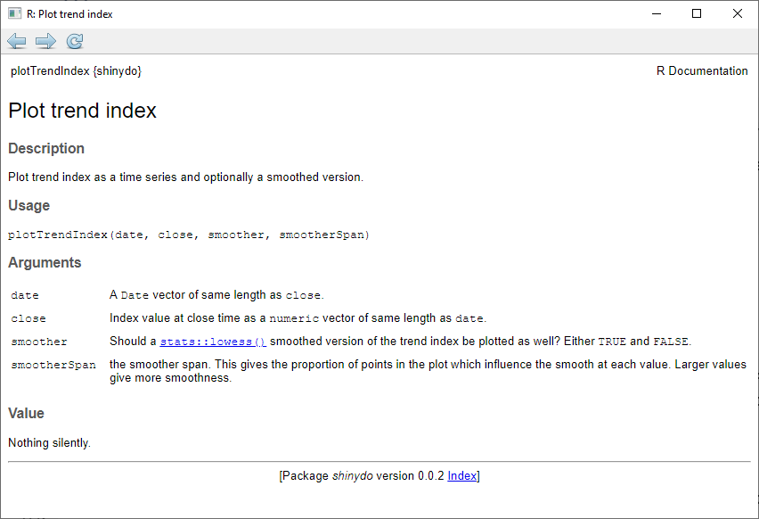

```{r, include = FALSE}
knitr::opts_chunk$set(
  collapse = TRUE, 
  echo = TRUE,
  eval = FALSE,
  comment = "#>"
)
```


`shinydo` is the path 
---------------------

Away from painful scripting toward shiny engineering

```{r, echo=FALSE, eval=TRUE, layout="l-page", fig.height=2}
DiagrammeR::grViz(diagram = "images/graphScripts/path.gv", width = '100%')
```


Only the craftsman can walk the path

# Key ideas

1. R is functional: use [functions](https://r4ds.had.co.nz/functions.html) and  [shiny modules](https://mastering-shiny.org/scaling-modules.html).
1. R is software: use [version control]((https://git-scm.com/)) and [packages](https://r-pkgs.org/). 
1. Teamwork needs processes: use [Golem](https://engineering-shiny.org/index.html).

A curriculum concludes this presentation


## R, if you did not know

R is a first choice programming language for:
    
- data analysis via statistics, machine learning, mining ...
- visualisation of tables, maps, networks ...
- publication of reports, book, reproducible research ...

Shiny brings the analysis results to users via a gui.


# Individual contribution

The boss tasks you with developing a Google trend index analysis. 
You submit the following shiny app.

```{r,echo=TRUE,eval=FALSE}
shinydo::runInternalApp(
  appName = 'googleTrendIndex_V0', 
  display.mode = 'showcase'
)
```

What do you think of it?


## My take: small is beautiful

Because the app is tiny, the code seems acceptable.

* The code is divided in sections with clear purposes
* The code is readable due to spanning many short lines
* Comments are plentiful and informative
* Variable names are descriptive

None the less, its structure will  not survive extension. 

## Google, Bing, and Yahoo

The boss now wants you to include Bing and Yahoo.

How do you do it?
    
```{r,echo=TRUE,eval=FALSE}
shinydo::pauseAndThinkAboutIt(seconds = 15)
message('Share your ideas via the common chat.')
```

Copy, paste, rename ?
----

```{r,echo=TRUE,eval=FALSE}
shinydo::runInternalApp(
  appName = 'googleTrendIndex_V1', 
  display.mode = 'showcase'
)
```

My take: Do not do that! 
----

* Unstructured length begets repulsion and tedium.
* Repetition kills readability and maintainability.
* Intertwining business and shiny processes confuses.

Such code usually dies off in abandon. But not always...

## Top 10 search engines analysis

The boss now wants a top 10 analysis. 

How do you do it?
    
```{r,echo=TRUE,eval=FALSE}
shinydo::pauseAndThinkAboutIt(seconds = 15)
message('Share your ideas via the common chat.')
```

Good ideas
----

* Negotiate to first provide a top 5 to buy time
* Restructure the code and enable future extensions
* Leverage the functional nature of R
* Separate frontend, backend and support functions


Good organisation
----

```{r,eval=TRUE,echo=FALSE}
fs::dir_tree(path = shinydo::getInternalAppFolder(appName = 'googleTrendIndex_V2'), recurse = TRUE)
```

Good implementation
----

* Define the frontend in ui.R 
* Define the backend in server.R
* Define frontend and backend in app.R if trivial
* Define the functions in the R/ folder
* Implement the business logic in pure R functions
* Implement the shiny logic as shiny modules


## Shiny modules structure apps

* A Shiny module encapsulates Shiny logic
* A Shiny module avoids code repetition 
* A Shiny module can be tested
* A Shiny module can be nested
* A Shiny module is a pair of functions 
  * One function defines a ui building block
  * One function defines the associated server logic
  
Shiny module demo
----

```{r,echo=TRUE,eval=FALSE}
shinydo::runInternalApp(
  appName = 'shinyModuleDemo', 
  display.mode = 'showcase'
)
```

* `exampleModuleUI` and `exampleModuleServer` define the module
* The module is called twice
  * Once with identifier `examplemodule1`
  * Once with identifier `examplemodule2`.

Shiny module demo code : organisation
----

```{r,eval=TRUE,echo=FALSE}
fs::dir_tree(path = shinydo::getInternalAppFolder(appName = 'shinyModuleDemo'), recurse = TRUE)
```

Shiny module demo code : ui
----


```{r, echo=FALSE, results='asis',eval=TRUE}
moduleCode = readLines(con = file.path(
    shinydo::getInternalAppFolder(), 'shinyModuleDemo', 'R', 'example-module.R')
)
moduleCode = moduleCode[seq(from = 1, to = which.max(moduleCode == '}'))]
res <- knitr::knit_child(text = c(
    '```{r,echo=TRUE,eval=FALSE}',
    moduleCode,
    '```',
    ''
  ), envir = environment(), quiet = TRUE)
cat(unlist(res), sep = '\n')
```


Shiny module demo code : server
----

```{r, echo=FALSE, results='asis',eval=TRUE}
moduleCode = readLines(con = file.path(
    shinydo::getInternalAppFolder(), 'shinyModuleDemo', 'R', 'example-module.R')
)
moduleCode = moduleCode[seq(from = which.max(moduleCode == '}') + 2, 
                            to = length(moduleCode))]
res <- knitr::knit_child(text = c(
    '```{r,echo=TRUE,eval=FALSE}',
    moduleCode,
    '```',
    ''
  ), envir = environment(), quiet = TRUE)
cat(unlist(res), sep = '\n')
```


## Top 5 search engine trend index


```{r,echo=TRUE,eval=FALSE}
shinydo::runInternalApp(
  appName = 'googleTrendIndex_V2', 
  display.mode = 'showcase'
)
```

The top 5 app structure is so crystal clear, there is no need to split its code
between ui.R and server.R

plotTrendIndex
----

```{r, echo=FALSE, results='asis',eval=TRUE}
moduleCode = readLines(con = file.path(
    shinydo::getInternalAppFolder(), 'googleTrendIndex_V2', 'R', 'plotTrendIndex.R')
)
res <- knitr::knit_child(text = c(
    '```{r,echo=TRUE,eval=FALSE}',
    moduleCode,
    '```',
    ''
  ), envir = environment(), quiet = TRUE)
cat(unlist(res), sep = '\n')
```


* The plot function is pure R 
* The plot function can be developed, tested and reused independently

indexTrendModule.R
----

* The module code is as simple as the very first app. 
* No nested module required

```{r, echo=FALSE, results='asis',eval=TRUE}
moduleCode = readLines(con = file.path(
    shinydo::getInternalAppFolder(), 'googleTrendIndex_V2', 'R', 'indexTrendModule.R')
)
res <- knitr::knit_child(text = c(
    '```{r,echo=TRUE,eval=FALSE}',
    moduleCode,
    '```',
    ''
  ), envir = environment(), quiet = TRUE)
cat(unlist(res), sep = '\n')
```


## Top 10 search engine trend index

Extending the app to a top 10 is now trivial.

```{r,echo=TRUE,eval=FALSE}
shinydo::runInternalApp(
  appName = 'googleTrendIndex_V3', 
  display.mode = 'showcase'
)
```

The boss is happy and praises you. You bask in glory.

# Sharing is caring

Colleagues want to build on your analysis and app. <br>
The boss orders you to share.

How do you do it?
    
```{r,echo=TRUE,eval=FALSE}
shinydo::pauseAndThinkAboutIt(seconds = 15)
message('Share your ideas via the common chat.')
```

Please, do not
--------------
    
* Share code via mail or folder
* Assume users will make it work alone
* Organise "quick" explain and install meetings
* Organise even "quicker" bug fix meetings

Instead, do this
----------------

* ~~Convert your code into~~ Write a R package 
* Store the package on a repository
* Direct users to the repository
* When needed, update the package in the repo

Simple for users
-----------------


```{r}
# Get started
install.packages('shinydo')
vignette(package = 'shinydo', 'shinydo')
shinydo::showPresentation()

# Run the app
shinydo::startTrendIndexDashboard ()

# Query documentation
?shinydo::getTrendIndexData
?shinydo::plotTrendIndex

# Use key functions
trend_data = shinydo::getTrendIndexData(searchEngine = 'Google')
trend_data = subset(x = trend_data, subset = type == 'A')
shinydo::plotTrendIndex(date = trend_data$date, 
                        close = trend_data$close, 
                        smoother = TRUE, 
                        smootherSpan = 0.3)
```

## R packages 101

1. Create the package skeleton
1. List required packages in `DESCRIPTION`
1. Implement and document functions in `R/`

```{r,eval=TRUE,echo=TRUE,results='hide',warning=FALSE,message=FALSE}
packageFolder = file.path(tempdir(), 'demoPackage')
devtools::create(path = packageFolder, open = FALSE)
```

```{r,eval=TRUE,echo=FALSE}
fs::dir_tree(path = packageFolder, recurse = FALSE)
```


A `DESCRIPTION` file
--------------------

```{r,eval=TRUE,echo=FALSE,results='asis'}
moduleCode = readLines(con = './../DESCRIPTION')
moduleCode = c('```{r,echo=TRUE,eval=FALSE,cap="DESCRIPTION"}', moduleCode, '```')
cat(paste(moduleCode, collapse = '\r\n'))
```

A documented function
---------------------

```{r, echo=FALSE, results='asis',eval=TRUE}
moduleCode = readLines(con = './../R/plotTrendIndex.R')
res <- knitr::knit_child(text = c(
    '```{r,echo=TRUE,eval=FALSE}',
    moduleCode,
    '```',
    ''
  ), envir = environment(), quiet = TRUE)
cat(unlist(res), sep = '\n')
```

A function documentation
------------------------




## Test 101

1. ~~Manually call functions with random inputs~~
1. Design test scenarios
1. Automatically run test scenarios


```{r,eval=TRUE,echo=TRUE,results='hide',warning=FALSE,message=FALSE}
# Be in the project directory
setwd(packageFolder)
# creates and opens R/myNewFunction.R
usethis::use_r(name = "myNewFunction")   
# creates and opens tests/testthat/test-myNewFunction.R
usethis::use_test(name = "myNewFunction") 
```

```{r,eval=TRUE,echo=FALSE}
fs::dir_tree(path = packageFolder, recurse = TRUE)
```

A simple test
--------------

```{r}
test_that("multiplication works", {
    expect_equal(2 * 2, 4)
})

test_that("myNewFunction works", {
    expect_equal(myNewFunction(wellChosenInput), expectedOutput)
    expect_error(myNewFunction(wrongInput), 'Error message')
})

```

Run tests with `devtools::test()`

## R packages 102

1. Build the documentation
1. Build the package file

```{r,echo=TRUE,eval=FALSE}
devtools::document()
devtools::build()
```

## R packages 103

* Store package in a repository such as [github](https://github.com/).
* Deploy the app on a server or RStudio Connect

## Shiny package 101

Shiny modules and an app starting function

```{r, echo=FALSE, results='asis',eval=TRUE}
moduleCode = readLines(con = './../R/appFunctions.R')
res <- knitr::knit_child(text = c(
    '```{r,echo=TRUE,eval=FALSE}',
    moduleCode,
    '```',
    ''
  ), envir = environment(), quiet = TRUE)
cat(unlist(res), sep = '\n')
```


## Main benefits of R packages

* This standard is a well established and documented 
  * Tools, processes and conventions save time 
  * Users expect and are used to packages
* The package enables many quality improving features
  * Documentation of functions and tutorial for usages
  * Test of functions, including shiny modules
  * Reproducible research / data analysis

# Teamwork

The boss orders you to lead a team to extend the tool.

How do you organise development?


```{r,echo=TRUE,eval=FALSE}
shinydo::pauseAndThinkAboutIt(seconds = 15)
message('Share your ideas via the common chat.')
```


## Hire the relevant expertise

* Architecture
* Cyber-security
* Dev Ops
* User experience / User interface

The IT department can support you.

## A focus on processes

A software product emerges from the systemic interactions between developers, 
processes, tools, code and users

The [Golem](https://engineering-shiny.org/index.html) framework is process template 

## Design

1. Understand the users' need and document it
1. Sketch the user interface with users
1. Style the user interface with users
1. Draw the architecture 

## Prototype

1. Prototype the ui with a place holding back-end 
1. Prototype the business logic
1. Users should test and approve in simple cases

## Build

1. Keep business logic, shiny logic and style apart
1. Define processes w.r.t. to version control, development and tests
1. Build the Ui and gather user approval
1. Implement, document and test the business logic
1. Combine business and shiny logic into modules

## Strengthen

1. Test in a reproducible environment
1. Test automatically thanks to continuous integration
1. Test business logic, interactivity, visualisations ...
1. Test speed, memory consumption, load resistance ...

## Deploy

1. Decide how you share:
    * Code
    * Package
    * Shiny server access
    * ...
1. Design, implement and automate the delivery processes

# Questions

# R curriculum

```{r, echo=FALSE,eval=TRUE, results='asis'}
res <- knitr::knit_child("./r-curriculum.Rmd", quiet = TRUE)
#res = gsub(pattern = '##', replacement = '###', x = res)
cat(res, sep = '\n')
```

```{r,eval=FALSE, child="./r-curriculum.Rmd"}

```

